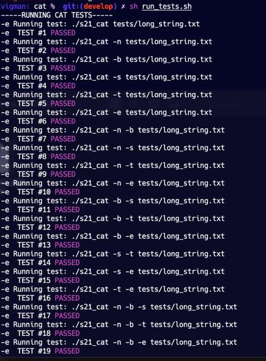
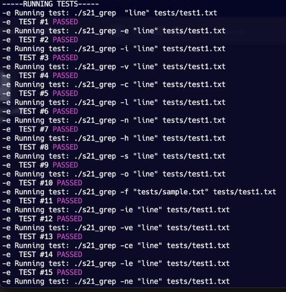

# Cat & Grep

## Introduction

Implementation of GNU `cat` and BSD `grep`.

## Goals

- Understand file processing in C
- Implement error handling in C
- Parsing of command line arguments
- Become familiar with the regex.h 
- Implement integration tests

## Build

```
$ git clone https://github.com/SergeyVigman/simple_bash_utility
$ cd s21_cat_grep/src/
$ make
```

## S21_cat

### s21_cat Usage

`$ s21_cat [OPTION] [FILE] ...`

### s21_cat Options

| No. | Options | Description |
| ------ | ------ | ------ |
| 1 | -b (GNU: --number-nonblank) | numbers only non-empty lines |
| 2 | -e implies -v (GNU only: -E the same, but without implying -v) | but also display end-of-line characters as $  |
| 3 | -n (GNU: --number) | number all output lines |
| 4 | -s (GNU: --squeeze-blank) | squeeze multiple adjacent blank lines |
| 5 | -t implies -v (GNU: -T the same, but without implying -v) | but also display tabs as ^I  |

### s21_cat Integration tests

s21_cat fully replicates original GNU cat functionality, including all major flags.
Before launching tests s21_cat executable must be built. <br>
Integration tests are launched via bash script `cat/run_tests.sh`. 

```
$ ./run_tests.sh
```



> This was developed on MacOS, some tests may fail on other systems

## S21_grep

### s21_grep Usage

`s21_grep [OPTIONS] template [FILE] ...`

### s21_grep Options

| No. | Options | Description |
| ------ | ------ | ------ |
| 1 | -e | pattern |
| 2 | -i | Ignore uppercase vs. lowercase.  |
| 3 | -v | Invert match. |
| 4 | -c | Output count of matching lines only. |
| 5 | -l | Output matching files only.  |
| 6 | -n | Precede each matching line with a line number. |
| 7 | -h | Output matching lines without preceding them by file names. |
| 8 | -s | Suppress error messages about nonexistent or unreadable files. |
| 9 | -f file | Take regexes from a file. |
| 10 | -o | Output the matched parts of a matching line. |

### s21_grep Integration tests

s21_grep replicated major BSD grep (2.5.1-FreeBSD) flags and their combinations listed above. 

Before launching tests s21_cat executable must be built. <br>
Integration tests are launched via bash script `grep/run_tests.sh`. 

```
$ make testus
$ cd test && ./testus
```


> This was developed on MacOS, some tests may fail on other systems